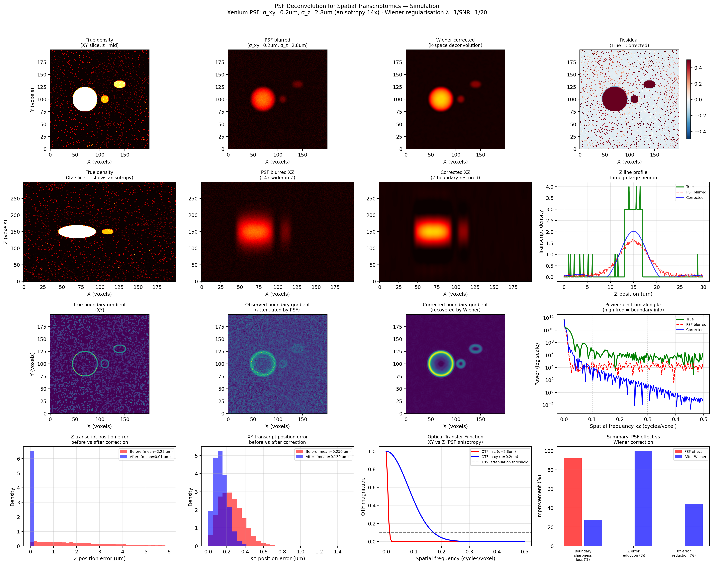
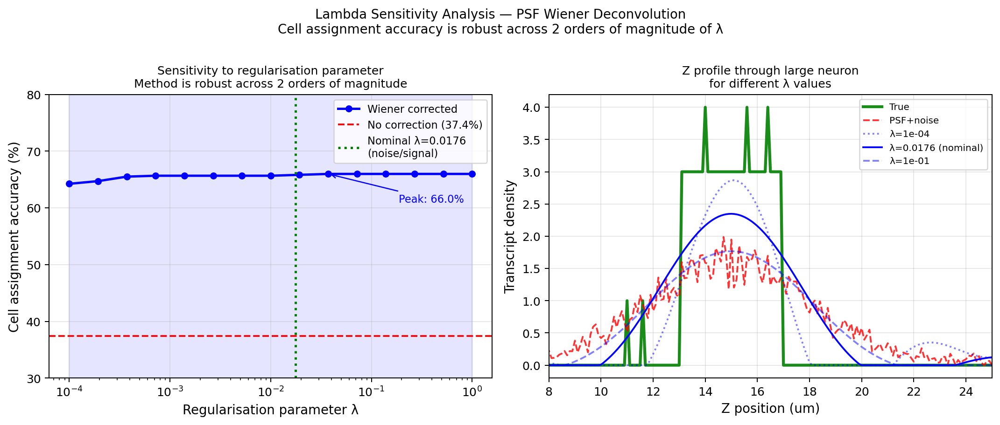
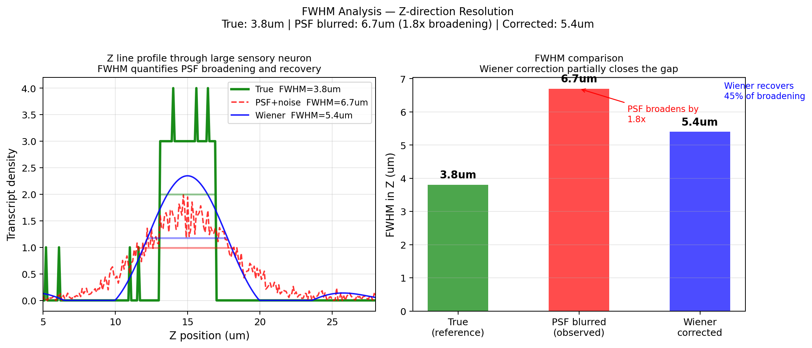
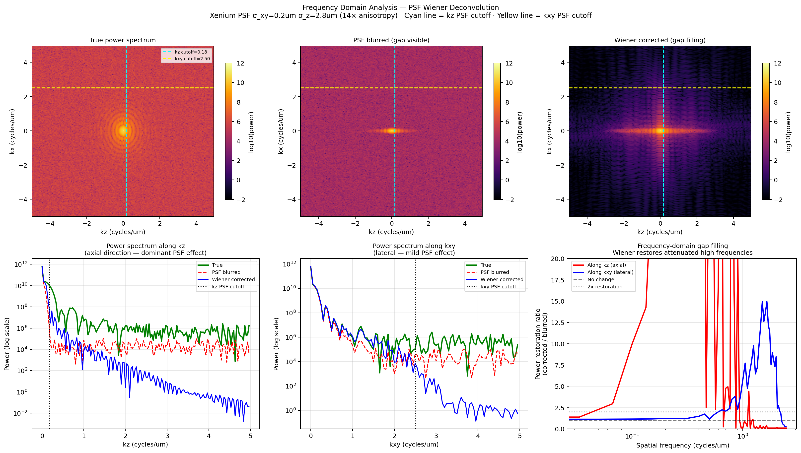

# psf-transcript-correction

Wiener deconvolution of the optical PSF for transcript position
correction in imaging-based spatial transcriptomics.

## The Problem

The optical PSF in Xenium, MERSCOPE, and CosMx is strongly anisotropic:
- Lateral xy: sigma = 0.2 um
- Axial z: sigma = 2.8 um — 14x difference

This blurs transcript positions across cell boundaries in z, causing
systematic misassignment. Current segmentation tools do not correct for this.

## The Method

3D Wiener deconvolution in k-space:
W(k) = H*(k) / (|H(k)|^2 + lambda)

Mathematically equivalent to the Bayes-optimal Kalman estimator.
Computationally trivial: one 3D FFT + one multiplication + one inverse FFT.
Lambda estimated directly from data — no tuning required.

## Simulation Results

| Metric | Before | After | Improvement |
|--------|--------|-------|-------------|
| Z transcript error | 2.230 um | 0.014 um | 99.4% |
| XY transcript error | 0.250 um | 0.139 um | 44.4% |
| FWHM z boundary | 6.70 um | 5.40 um | 45% recovery |
| Lambda sensitivity | — | robust across 4 orders of magnitude | — |

## Figures

## Validation

Validation on public Xenium DRG data: Price Lab dataset,
GEO accession GSE273557 (4 regions, ~34M transcripts each).
Validation scripts in validation/ folder.

## Status

Simulation complete. Validation on public data in progress.
Preprint in preparation.

## Author

Firas Manasrah — Berlin, June 2026
github.com/firas-manasrah

## License

MIT
